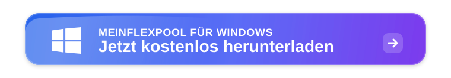
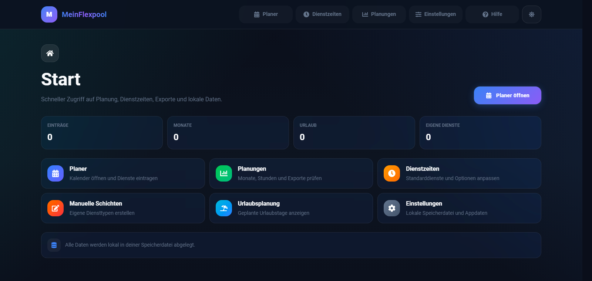
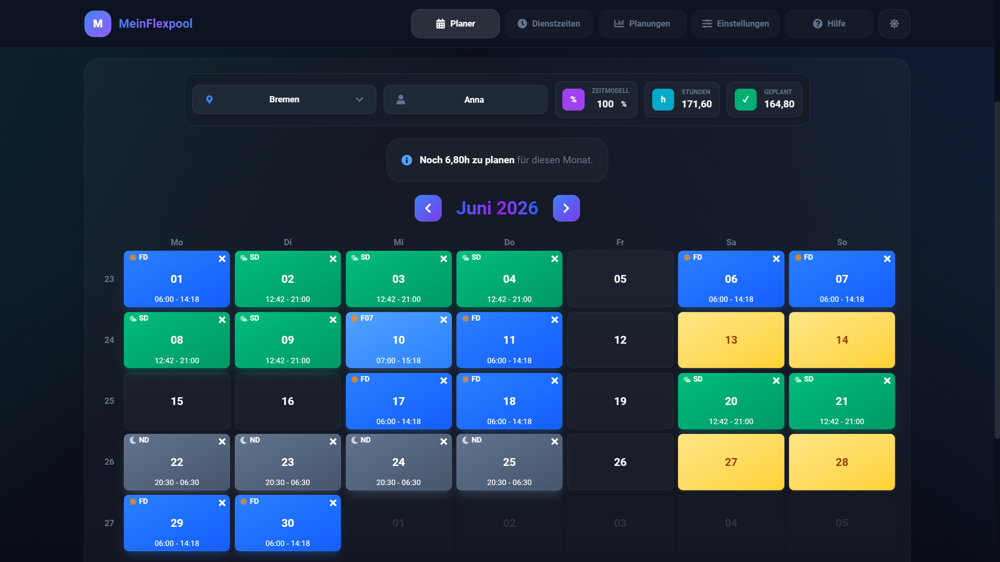
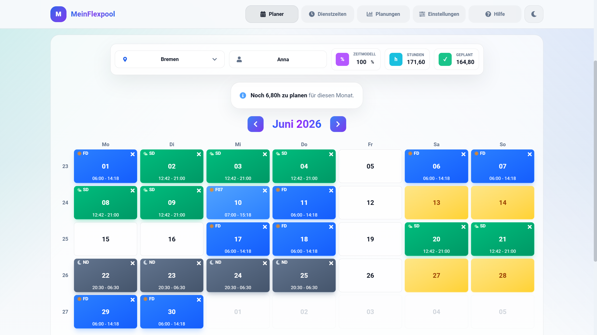

<p align="center">
  
</p>

<h1 align="center">MeinFlexpool</h1>

<p align="center">
  <strong>Dienstplanung. Flexibel. Einfach.</strong><br>
  Plane deinen Dienstmonat übersichtlich, schnell und direkt auf deinem Windows-Gerät.
</p>

<p align="center">
  <a href="https://github.com/Rezken/MeinFlexpool/releases/latest/download/MeinFlexpool-Setup.exe">
    
  </a>
</p>

<p align="center">
  <sub>Für Windows 10 und Windows 11. Keine Anmeldung erforderlich.</sub>
</p>

## Installation

<table>
  <tr>
    <td width="33%">
      <strong>1. Herunterladen</strong><br>
      Lade <strong>MeinFlexpool-Setup.exe</strong> über den Download-Link herunter.
    </td>
    <td width="33%">
      <strong>2. Installieren</strong><br>
      Starte den Installer per Doppelklick und folge dem Installationsfenster.
    </td>
    <td width="33%">
      <strong>3. Loslegen</strong><br>
      Öffne MeinFlexpool über das Desktop-Symbol oder das Startmenü.
    </td>
  </tr>
</table>

<table>
  <tr>
    <td width="96" align="center" valign="middle">
      
    </td>
    <td valign="middle">
      <h3>Achtung: Windows kann beim ersten Start eine Warnung ausgeben</h3>
      <p>
        MeinFlexpool ist aktuell noch nicht code-signiert. Deshalb kann Windows SmartScreen beim ersten Start eine Sicherheitsabfrage anzeigen.
      </p>
      <p>
        Wenn du MeinFlexpool direkt von dieser offiziellen Download-Seite geladen hast, klicke in der Windows-Meldung auf <strong>Weitere Informationen</strong> und danach auf <strong>Trotzdem ausführen</strong>.
      </p>
    </td>
  </tr>
</table>

<p align="center">
  
  
  
  
</p>

<p align="center">
  
</p>

<p align="center">
  
</p>

## Light Mode

MeinFlexpool kann wahlweise im dunklen oder hellen Erscheinungsbild genutzt werden. Der Light Mode sorgt für eine helle, klare Oberfläche, wenn du lieber mit mehr Kontrast zum Raumlicht oder in einer klassischen Desktop-Optik arbeitest.

<p align="center">
  
</p>

---

## MeinFlexpool herunterladen

Die aktuelle Version findest du immer hier:

[Zur neuesten MeinFlexpool-Version](https://github.com/Rezken/MeinFlexpool/releases/latest)

Direkter Download des Installers:

[MeinFlexpool-Setup.exe direkt herunterladen](https://github.com/Rezken/MeinFlexpool/releases/latest/download/MeinFlexpool-Setup.exe)

Dieses Repository ist die offizielle Download- und Update-Seite für MeinFlexpool. Der Quellcode der App ist hier nicht enthalten.

## Funktionen

MeinFlexpool bündelt die wichtigsten Schritte deiner Dienstplanung in einer lokalen Windows-App: planen, Dienstzeiten anpassen, eigene Schichten erstellen und fertige Monatspläne exportieren.

<table>
  <tr>
    <td width="50%" valign="top">
      <p>
        <br>
        <strong>Monatsplanung im Kalender</strong>
      </p>
      <p>Dienste direkt im Monatskalender eintragen, ändern und prüfen. Wochenenden, Feiertage und Sollstunden bleiben dabei übersichtlich im Blick.</p>
    </td>
    <td width="50%" valign="top">
      <p>
        <br>
        <strong>Dienstzeiten flexibel anpassen</strong>
      </p>
      <p>Früh-, Spät- und Nachtdienste nach deinem Arbeitsmodell konfigurieren. Pausen, Uhrzeiten und besondere Varianten bleiben lokal gespeichert.</p>
    </td>
  </tr>
  <tr>
    <td width="50%" valign="top">
      <p>
        <br>
        <strong>Eigene Schichten erstellen</strong>
      </p>
      <p>Individuelle Dienste mit Kürzel, Farbe, Beginn, Ende und Pause anlegen. So passt MeinFlexpool auch zu Dienstmodellen außerhalb des Standards.</p>
    </td>
    <td width="50%" valign="top">
      <p>
        <br>
        <strong>Pläne sauber exportieren</strong>
      </p>
      <p>Fertige Monatspläne als PDF, Bild oder Excel-Datei ausgeben. Ideal zum Ablegen, Teilen oder Weiterverarbeiten.</p>
    </td>
  </tr>
</table>

## Automatische Updates

MeinFlexpool prüft automatisch, ob eine neue Version verfügbar ist. Wenn ein Update bereitsteht, wird es im Hintergrund heruntergeladen. Danach fragt MeinFlexpool, ob die App neu gestartet werden soll, um das Update zu installieren. Den aktuellen Update-Status und eine manuelle Prüfung findest du in der App unter `Einstellungen`.

Deine lokalen Daten bleiben bei Updates erhalten.

## Häufige Fragen

<details>
  <summary><strong>Muss ich mich anmelden?</strong></summary>
  Nein. MeinFlexpool hat keinen Login und keine Benutzerkonten. Die App startet direkt.
</details>

<details>
  <summary><strong>Funktioniert MeinFlexpool offline?</strong></summary>
  Ja. Die Planung funktioniert lokal auf deinem Windows-Gerät. Internet wird nur für Download und automatische Updates benötigt.
</details>

<details>
  <summary><strong>Wo werden meine Daten gespeichert?</strong></summary>
  Deine Daten werden lokal auf deinem Gerät gespeichert. Den genauen Speicherort findest du in MeinFlexpool unter `Einstellungen`.
</details>

<details>
  <summary><strong>Bleiben meine Daten bei Updates erhalten?</strong></summary>
  Ja. Updates ersetzen die App, aber nicht deine lokale Speicherdatei.
</details>

<details>
  <summary><strong>Was mache ich bei einem neuen PC?</strong></summary>
  Erstelle auf dem alten Gerät ein Backup in den Einstellungen und importiere es anschließend auf dem neuen Gerät.
</details>

## Version und Änderungen

Die neueste Version findest du immer unter:

```text
https://github.com/Rezken/MeinFlexpool/releases/latest
```

Änderungen werden zusätzlich in der App unter `Einstellungen` und `Changelog` angezeigt.

## Systemvoraussetzungen

- Windows 10 oder neuer
- 64-Bit-System
- Internetverbindung nur für Download und automatische Updates erforderlich

## Hinweis

MeinFlexpool ersetzt keine rechtliche oder betriebliche Prüfung von Dienstplänen. Bitte beachte immer die für dich geltenden betrieblichen Vorgaben, Tarifregelungen und gesetzlichen Bestimmungen.
